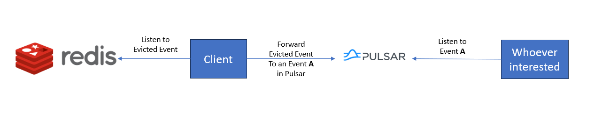

# Redis Pulsar Messaging and Monitoring System

This repo consists of a simple example using Redis and Apache Pulsar to build
a messaging system which uses Redis as a messaging system and also monitors
Redis status, and passing these information to Pulsar consumers.

In this example, we can use Redis as a [messaging system](./src/investigation/redis_publisher.py),
or we could monitor Redis events, e.g., [key eviction](./src/redis_data_inserts.py).

Once a Redis event happens (a message to a system topic)
or we send a message to a customized topic, we have an [agent](./src/middle_man.py)
listing to that topic and pass along the message to a topic in Pulsar.
Then the message is received by a [pulsar consumer](./src/pulsar_receiver.py).

Please note since we need to trigger Redis eviction event, we set a small
memory size of Redis, and choose random key eviction as the 
[eviction policy](./docker/redis.conf).
